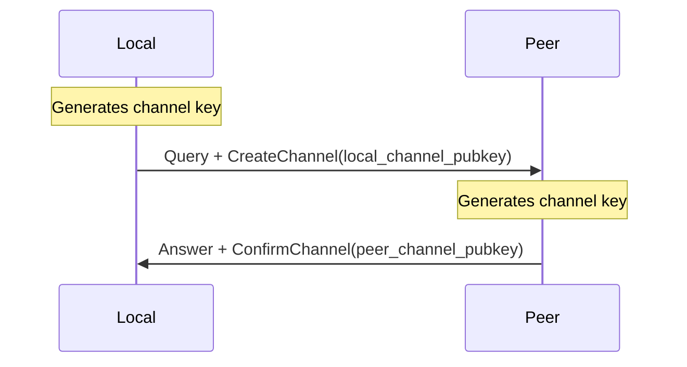
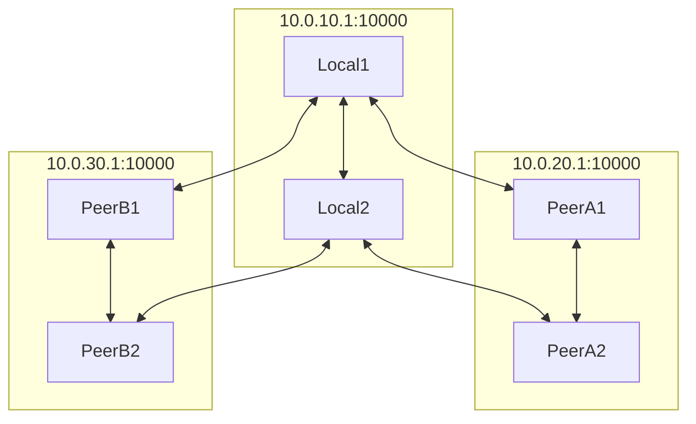
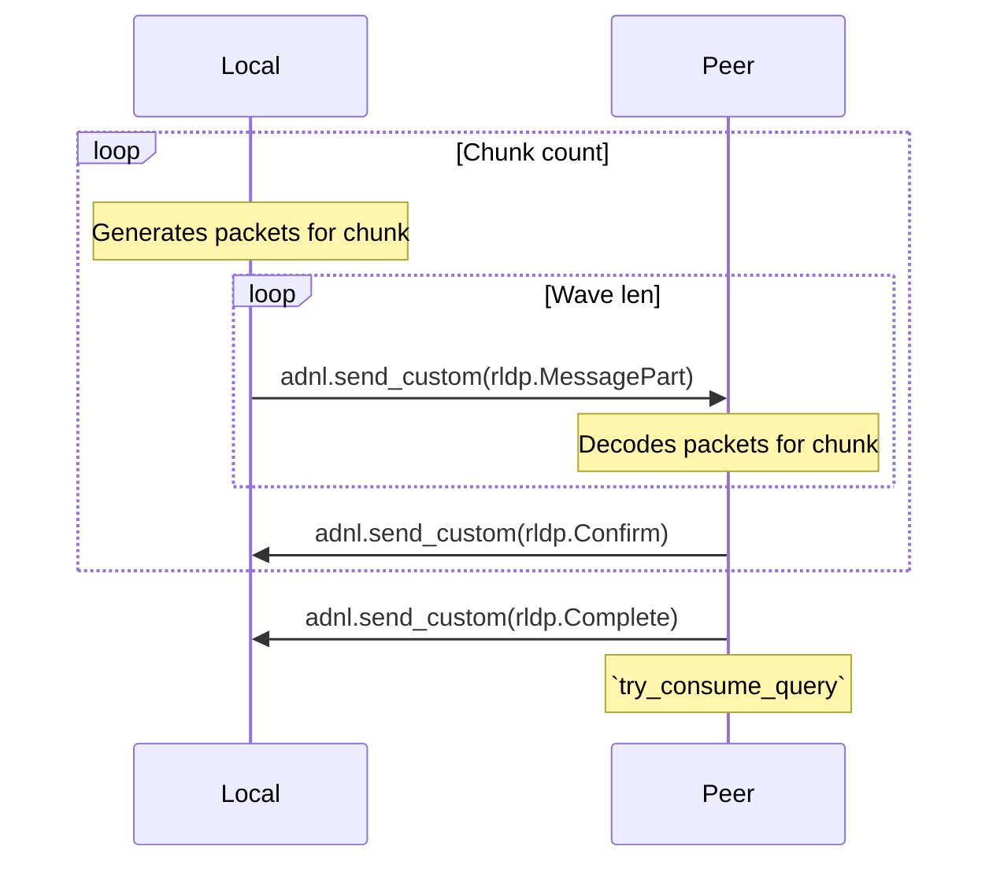
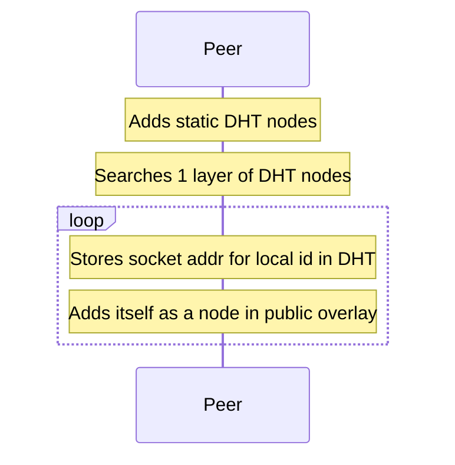

# Workshop
# 14.01.2023

---
layout: center
class: text-center
---

# everscale-network

<br/>


<!--TL-->
---

# TL Language

```rust
// builtins
int ? = Int;
long ? = Long;
string ? = String;
bytes data:string = Bytes;
true = True;
boolTrue = Bool;
boolFalse = Bool;

vector {t:Type} # [ t ] = Vector t;

---types---

myConstructor firstField:int secondField:int = MyClass;

firstConstructor someField:Bool = MyEnum;
secondConstructor fields:(vector int) = MyEnum;

---functions---

doSomething params:MyClass = MyEnum;

```

<!--TL scheme-->
---
layout: two-cols
---

# TL Scheme

```rust
int ? = Int;
string ? = String;
bytes data:string = Bytes;

int256 8*[ int ] = Int256;

pub.ed25519 key:int256 = PublicKey;
pub.aes key:int256 = PublicKey;
pub.overlay name:bytes = PublicKey;
```

::right::

# Code

```rust
#[derive(TlWrite, TlRead)]
#[tl(boxed)]
pub enum PublicKey {
    #[tl(id = "pub.ed25519")]
    Ed25519 { key: [u8; 32] },
    #[tl(id = "pub.aes")]
    Aes { key: [u8; 32] },
    #[tl(id = "pub.overlay")]
    Overlay { name: Vec<u8> },
}
```

<!--TL encoding-->
---

# TL Encoding

| Type | Pseudocode |
| -------- | -------- |
| `()` | `[]` |
| `i32`,`u32`,`i64`,`u64` | `little_endian(x)` |
| `true` | `[0xb5, 0x75, 0x72, 0x99]` |
| `false` | `[0x37, 0x97, 0x79, 0xbc]`
| `[u8; N], N % 4 ≡ 0`) | `[…x]` |
| `Vec<u8>, len < 254`) | <code>[len as u8, …x, …padding_to_4(len)]</code> |
| `Vec<u8>, len ≥ 254`) | <code>[254, …little_endian(x)[0..=2], …x, …padding_to_4(len)]</code> |
| `Vec<T>` | `[…little_endian(len as u32), …map(…x, tl_repr)]` |
| `(T0, … , Tn)` | `[…tl_repr(T0), … , …tl_repr(Tn)]`  |
| `Option<T>` | `{ Some(x) ⇒ tl_repr(x), None ⇒ [] }` |
| `enum { T0, …, Tn }` | `{ T0(x) ⇒ […id(T0), …tl_repr(x)], …, Tn(x) ⇒ […id(Tn), …tl_repr(x)] }` |

<style>
.slidev-layout td, .slidev-layout th {
  padding: 0.2rem;
}
</style>


<!--ADNL -->
---

# ADNL address

```rust
pub.ed25519 key:int256 = PublicKey;
pub.aes key:int256 = PublicKey;
pub.overlay name:bytes = PublicKey;
```

<br>

```rust
use everscale_crypto::ed25519;
use everscale_network::adnl;

let secret_key = ed25519::SecretKey::generate(&mut rand::thread_rng());
let public_key = ed25519::PublicKey::public_key(&secret_key);

let peer_id_full = adnl::NodeIdFull::new(public_key);
let peer_id: adnl::NodeIdShort = peer_id_full.compute_short_id();
```

<br>

> $peer\_id = hash(tl\_repr(public\_key)$


<!--ADNL peer -->
---

# ADNL peer

```rust
struct Peer {
    /// Remote peer public key.
    id: adnl::NodeIdFull,
    /// IPv4 address.
    addr: SocketAddrV4,

    /// Channel key pair to encrypt messages from our side.
    channel_key: ed25519::KeyPair,

    /// Packets receiver state.
    receiver_state: PeerState,
    /// Packets sender state.
    sender_state: PeerState,
}

struct PeerState {
    /// Packet deduplication slots.
    packet_history: PacketHistory,
    /// Remote init date.
    reinit_date: u32,
}
```

<!--ADNL handshake packet -->
---

# ADNL transport

## Handshake packet

<br>

<div class="flex justify-center">
  
  
</div>

<br>

$$
header\_len\_orig_{handshake} = 96\ bytes \\
header\_len\_ever_{handshake} = 100\ bytes
$$

<style>
img.inverted {
  filter: invert(1);
}
</style>

<!--ADNL handshake encryption -->
---

# ADNL transport

## Handshake encryption

```rust
pub fn build_handshake_packet(peer_id_full: &NodeIdFull, payload: &[u8]) -> Vec<u8> {
    // Generate temp key (ed25519) and shared secret (x25519)
    let temp_private_key = ed25519::SecretKey::generate(&mut rand::thread_rng());
    let temp_private_key = ed25519::ExpandedSecretKey::from(&temp_private_key);
    let temp_public_key = ed25519::PublicKey::from(&temp_private_key);
    let shared_secret = temp_private_key.compute_shared_secret(peer_id_full.public_key());

    let checksum = Sha256::digest(payload);

    let aes_key_bytes: [u8; 32] = ...; // shared_secret[0..16] + checksum[16..32]
    let aes_ctr_bytes: [u8; 16] = ...; // checksum[0..4] + shared_secret[20..32]

    let mut result = Vec::new(); // encode header and payload
    result.extend_from_slice(peer_id_full.compute_short_id().as_slice());
    result.extend_from_slice(temp_public_key.as_bytes());
    result.extend_from_slice(checksum.as_slice());
    result.extend_from_slice(payload);

    Aes256Ctr::new(aes_key_bytes, aes_ctr_bytes).apply_keystream(96..); // encrypt payload
    result // done
}
```

<!--ADNL channel packet -->
---

# ADNL transport

## Channel packet

<br>

<div class="flex justify-center">
  
  
</div>

<br>

$$
header\_len\_orig_{channel} = 64\ bytes \\
header\_len\_ever_{channel} = 68\ bytes
$$

<style>
img.inverted {
  filter: invert(1);
}
</style>


<!--ADNL packet payload -->
---
layout: two-cols
---

# ADNL transport

## Packet payload

```rust
struct Payload {
    /// Random bytes.
    rand1: Vec<u8>,

    /// Sender public key
    from: Option<PublicKey>,
    /// One or many messages.
    messages: Vec<Message>,
    /// Sender socket address.
    address: AddressList,
    /// Packet sequence number (sender side).
    seqno: u64,
    /// Known sequence number (receiver side).
    confirm_seqno: u64,
    /// Initialization dates.
    reinit_dates: Option<ReinitDates>,
    /// Optional signature.
    signature: Option<[u8; 64]>,

    /// Random bytes.
    rand2: Vec<u8>,
}
```

::right::

<br class="mt-11.5">

```rust
struct ReinitDates {
    /// Sender initialization time.
    local: u32,
    /// Receiver initialization time.
    target: u32,
}
```

<div class="ml-10 mt-5">
Summary:

- Sender `NodeIdFull` / `NodeIdShort`
- Seqno (new / known)
- Timestamps (new / known)
- Signature
- One or many messages
</div>


<!--ADNL message types -->
---

# ADNL transport

## Message types

```rust
enum Message {
    #[tl(id = "adnl.message.createChannel")]
    CreateChannel { key: [u8; 32], date: u32 }, // ask other peer to create channel

    #[tl(id = "adnl.message.confirmChannel")]
    ConfirmChannel { key: [u8; 32], peer_key: [u8; 32], date: u32 }, // confirm the requested channel

    #[tl(id = "adnl.message.query")]
    Query { query_id: [u8; 32], query: Vec<u8> }, // message to be answered

    #[tl(id = "adnl.message.answer")]
    Answer { query_id: [u8; 32], Vec<u8> }, // answer to the query

    #[tl(id = "adnl.message.custom")]
    Custom { data: Vec<u8> }, // unidirectional message

    #[tl(id = "adnl.message.part")]
    Part { hash: [u8; 32], total_size: u32, offset: u32, data: Vec<u8> }, // part of some bigger message

    #[tl(id = "adnl.message.nop")]
    Nop, // does nothing (but resets reinit dates)
}
```

<!--ADNL channel creation -->
---

# ADNL transport

## Channel creation



<!--ADNL summary-->
---

<div class="flex items-center">

<div class="flex-grow">



</div>

<div class="w-80">

* Public key
* Socket address

</div>

</div>

---

# DHT

## Buckets

```rust
struct Buckets {
  /// Short key id of the local ADNL node.
  local_id: NodeIdShort,
  /// DHT nodes, distributed by affinity.
  buckets: [HashMap<NodeIdShort, DhtPeer>; 256],
}
```

## Storage

```rust
type Storage = HashMap<KeyHash, Value>;
type KeyHash = [u8; 32];
```

<br>

## Proto

<div class="flex w-full">
<div class="flex-grow">

```rust
struct DhtPeer {
    id: PublicKey, // ADNL node public key
    address: AddressList, // one or multiple addresses
    version: u32, // init timestamp
    signature: [u8; 64],
}
```

</div>
<div class="flex-grow">

```rust
struct Value {
    key: KeyDescription, // full key info
    value: Vec<u8>, // arbitrary data
    ttl: u32, // value expiration timestamp
    signature: [u8; 64],
}
```

</div>
</div>


<div class="flex w-full">
<div class="flex-grow">
</div>
<div class="flex-grow">
</div>
</div>

---

# DHT

## Key

```rust
struct KeyDescription {
    key: Key, // key info
    id: PublicKey, // signer key (`PublicKey::Ed25519` or `PublicKey::Overlay`)
    update_rule: UpdateRule, // verification behavior
    signature: [u8; 64],
}

struct Key {
    id: [u8; 32], // either `NodeIdShort` or overlay id (see UpdateRule)
    name: Vec<u8>, // key name ('address', 'nodes')
    idx: u32, // key index
}

enum UpdateRule {
    #[tl(id = "dht.updateRule.signature")]
    Signature, // generic case for owned values.
    #[tl(id = "dht.updateRule.overlayNodes")]
    OverlayNodes, // special case for overlay nodes.
    #[tl(id = "dht.updateRule.anybody")]
    Anybody, // anybody can store unsigned value with this rule.
}
```

---

# DHT

## `Signature` flow:

<div class="flex w-full">
<div class="flex-grow">

- Sign basic key info (`Key`)
- Sign key description (`KeyDescription`)
- Store value locally (`hash(Key)`)
- Call `dht.store` for some known DHT nodes
- Optionally fetch value from the network

</div>
<div class="flex-grow">

```rust
#[derive(TlWrite, TlRead)]
#[tl(boxed, id = 0x11223344)]
struct MyCustomData {
    counter: u32,
}

let some_key: adnl::Key = ...;
let stored: bool = dht
    .entry(some_key.id(), "some_value")
    .with_data(MyCustomData { counter: 0 })
    .with_ttl(3600)
    .sign_and_store(some_key)?
    .then_check(|_, MyCustomData { counter }| {
        Ok(counter == 0)
    })
    .await?;
```

</div>
</div>

---

# DHT

## `OverlayNodes` flow:

- Verify overlay node info (reinit dates, signature, etc.)
- Merge this overlay node with known overlay nodes
    > - Signature is empty
    > - Key id is overlay id
    > - Public key is `PublicKey::Overlay`

- Call `dht.store` for some known DHT nodes (they will try to merge new nodes)
- Optionally fetch value from the network

---

# DHT

<br>

## Methods

```rust
dht.ping random_id:long = dht.Pong;               // simple ping
dht.store value:dht.value = dht.Stored;           // store value
dht.findNode key:int256 k:int = dht.Nodes;        // find k DHT nodes for some affinity
dht.findValue key:int256 k:int = dht.ValueResult; // find value (or receive some other nodes)
dht.getSignedAddressList = dht.Node;              // get signed DHT node info from the specified node

dht.query node:dht.node = True; // <- optional prefix to store local node while executing the query
```

<br>

## Bootstrap

- Add static nodes from global config
- For each static node call `dht.findNode(local_id, k)`
- Store all valid unique DHT nodes

---

# RLDP

## RaptorQ

<div class="flex justify-center">
  
</div>

<br>

`everscale-raptorq` - https://crates.io/crates/everscale-raptorq

---

# RLDP

<div class="flex justify-center">



</div>

---

# Overlays

<br>

<div class="flex w-full">
<div class="flex-grow">

## Public

- Nodes are stored in DHT
- Anyone can add itself to the list
- Id derived from workchain and zerostate file hash

<div class="mt-21.5 mr-10">

> For each workchain

</div>

</div>
<div class="flex-grow">

## Private

- Nodes are stored somewhere else

  (e.g. validator set in bc config)

- The set of nodes is known in advance
- Id derived from params and known node ids

<div class="mt-10 mr-10">

> For each catchain session

</div>

</div>
</div>

---

# Overlays

<br>

## Operations:

- Exchange random peers with the specified peer

- Send broadcast
  * Simple broadcast
  * FEC broadcast (if data size > 768 bytes)
- ADNL query to the specified peer (with `OverlayQuery` prefix)
- RLDP query to the specified peer (with `OverlayQuery` prefix)

```rust
#[tl(boxed, id = "overlay.query")]
struct OverlayQuery {
    overlay_id: [u8; 32],
}
```

---

# Overlays

## Public peer lifecycle

<div class="flex justify-center">



</div>

---

# Overlays

## Node RPC

```rust
tonNode.getNextBlockDescription prev_block:tonNode.blockIdExt = tonNode.BlockDescription;
tonNode.prepareBlockProof block:tonNode.blockIdExt allow_partial:Bool = tonNode.PreparedProof;
tonNode.prepareKeyBlockProof block:tonNode.blockIdExt allow_partial:Bool = tonNode.PreparedProof;
tonNode.prepareBlock block:tonNode.blockIdExt = tonNode.Prepared;
tonNode.preparePersistentState block:tonNode.blockIdExt masterchain_block:tonNode.blockIdExt = tonNode.PreparedState;
tonNode.prepareZeroState block:tonNode.blockIdExt = tonNode.PreparedState;
tonNode.getNextKeyBlockIds block:tonNode.blockIdExt max_size:int = tonNode.KeyBlocks;
tonNode.downloadNextBlockFull prev_block:tonNode.blockIdExt = tonNode.DataFull;
tonNode.downloadBlockFull block:tonNode.blockIdExt = tonNode.DataFull;
tonNode.downloadBlock block:tonNode.blockIdExt = tonNode.Data;
tonNode.downloadPersistentStateSlice block:tonNode.blockIdExt masterchain_block:tonNode.blockIdExt offset:long max_size:long
  = tonNode.Data;
tonNode.downloadZeroState block:tonNode.blockIdExt = tonNode.Data;
tonNode.downloadBlockProof block:tonNode.blockIdExt = tonNode.Data;
tonNode.downloadKeyBlockProof block:tonNode.blockIdExt = tonNode.Data;
tonNode.downloadBlockProofLink block:tonNode.blockIdExt = tonNode.Data;
tonNode.downloadKeyBlockProofLink block:tonNode.blockIdExt = tonNode.Data;
tonNode.getArchiveInfo masterchain_seqno:int = tonNode.ArchiveInfo;
tonNode.getArchiveSlice archive_id:long offset:long max_size:int = tonNode.Data;

tonNode.getCapabilities = tonNode.Capabilities;
```

---

# Overlays

## Broadcast

```rust
tonNode.blockSignature who:int256 signature:bytes = tonNode.BlockSignature;
tonNode.externalMessage data:bytes = tonNode.ExternalMessage;

tonNode.blockBroadcast
    id:tonNode.blockIdExt
    catchain_seqno:int
    validator_set_hash:int
    signatures:(vector tonNode.blockSignature)
    proof:bytes
    data:bytes
  = tonNode.Broadcast;
tonNode.externalMessageBroadcast message:tonNode.externalMessage = tonNode.Broadcast;
```

---

# Usage

- `ton-indexer` - "light-node" core

  * `ton-kafka-producer` - transactions streamer
  * `ever-wallet-api` -  self-hosted wallet management service
  * `octusbridge-relay` - Octus Bridge relay node that validates transfers across multiple blockchains
  * `everscan-indexer` - indexer for https://everscan.io

- `stever-node-tools` - all-in-one node management tool

- `everscale-monitoring` - network state monitoring, https://monitoring.ever.rs
